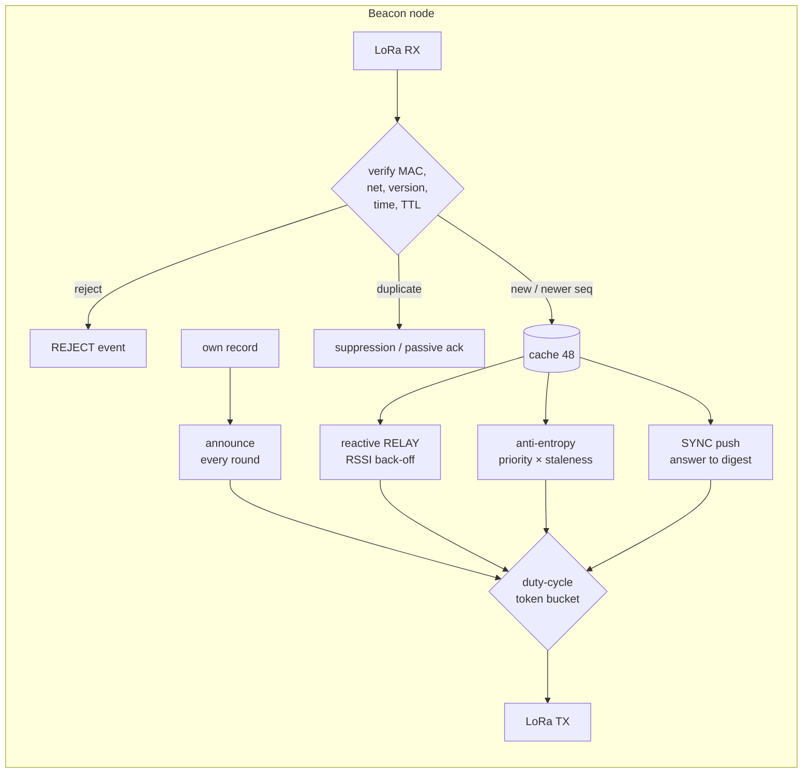
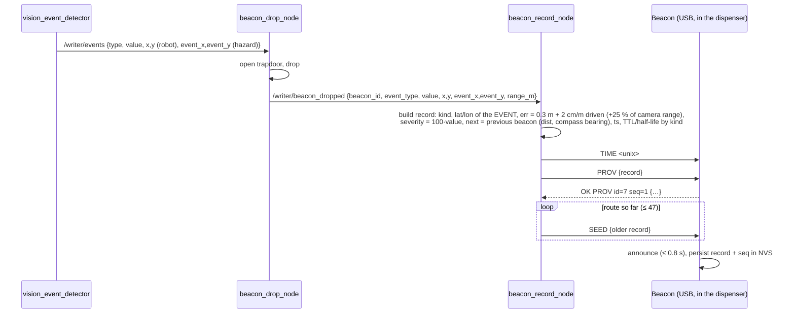

# Living Map Beacon Network (LMB2) — Architecture

TSYP14 · IEEE RAS × AESS · the Writer's dropped beacons, the radio network between them, and the path to the Command Post.

> **In one paragraph.** Every beacon the Writer drops carries one compact record of 44 bytes on the air: identity, event kind, GPS position with its error, severity, confidence, a *next-hop vector* (the way out), timestamp, TTL and a confidence *half-life*. Gas fades in minutes, an obstruction stays trusted for days. The frame is sealed with a truncated HMAC-SHA256 under a per-mission key and sent over LoRa at 868 MHz (SF9, 288 ms on air). The beacons gossip: each one stores its neighbours' records and re-broadcasts them. If a beacon is crushed, its record lives on in the others, and the network reports it as **lost**. A gateway at the entrance keeps a replica and feeds the Command Post dashboard. The same portable C code runs on the ESP32 firmware, the gateway and a network simulator. A 42-scenario stress matrix passes, including a 30-beacon chain through heavy rubble and a live attacker.

| | |
|---|---|
| Frame | **44 bytes**: 6 header + 30 signed record + 8 MAC |
| Example (brief) | `{"beacon_id":7,"kind":"VICTIM","gps":{"lat":34.4312,"lon":8.7845,"err_m":2.1},"severity":15,"next":{"id":6,"dist_m":8.5},"ttl_s":7200}` → `212a07000f00070001000101c0c8851488683c05150fff0006005500a094d068d0026801a283eea13e02c0f2` |
| Radio | LoRa 868.1 MHz, SF9 / 125 kHz / CR 4:5, 14 dBm, private sync word 0x12 |
| Time on air | 288 ms per record frame (SF7 93 ms · SF12 2139 ms) |
| Authentication | HMAC-SHA256 truncated to 64 bits, domain-separated ("LMB2"), per-mission 128-bit key |
| Replication | own announce · reactive relay · anti-entropy · pull digest (4 gossip mechanisms) |
| Duty cycle | provably ≤ 1 % per rolling hour (token bucket); measured 0.4–0.9 % |
| Latency to gateway | median 1–6 s, including 30-beacon rubble chains |
| Beacon loss | record kept by every survivor; "LOST?" at the Command Post ~8 min after (SF9) |
| RAM per node | ≈ 4.5 KB for a 48-record cache |

---

## Contents

1. [System context](#1-system-context)
2. [The record: 44 bytes on the air](#2-the-record-44-bytes-on-the-air)
3. [Adaptive aging](#3-adaptive-aging)
4. [Security](#4-security)
5. [Radio layer and regulation](#5-radio-layer-and-regulation)
6. [Gossip replication engine](#6-gossip-replication-engine)
7. [Resilience: what happens when things break](#7-resilience-what-happens-when-things-break)
8. [Verification: simulator, stress matrix, cross-checks](#8-verification)
9. [Provisioning: from the Writer to a beacon](#9-provisioning-from-the-writer-to-a-beacon)
10. [Gateway → Command Post](#10-gateway--command-post)
11. [Hardware, power, firmware](#11-hardware-power-firmware)
12. [Code map](#12-code-map)
13. [How to build, run and test](#13-how-to-build-run-and-test)
14. [Limitations and next steps](#14-limitations-and-next-steps)
15. [Parameter reference](#15-parameter-reference)

---

## 1. System context

```
   WRITER ROBOT (ROS 2)                      THE ZONE                                 COMMAND POST
 ┌─────────────────────────┐    drops    ┌───────────────────────────────┐   LoRa   ┌────────────────────────┐
 │ vision → event          │  ────────►  │  B1 ── B2 ── B3 ── … ── B14    │  ─────►  │ GATEWAY (ESP32+SX1276) │
 │ beacon_drop_node        │             │   ╲    gossip over LoRa   ╱     │          │  passive replica,      │
 │ beacon_record_node ─────┼── USB ──►   │    every beacon holds every    │          │  pull digests          │
 │  builds the 44-B record │  PROV/SEED  │    other beacon's record       │          └──────────┬─────────────┘
 └─────────────────────────┘             └───────────────────────────────┘                     │ USB serial, JSON lines
                                                         ▲                                     ▼
                                                         │ LoRa (same frames)       gateway_bridge.py ──HTTP──► dashboard
                                                 EXECUTOR ROBOT (optional receiver)          (Leaflet map, feed, mission planner)
```

* **Writer** (ROS 2): when vision reports a hazard, or the trail needs a breadcrumb, the dispenser drops a beacon. `beacon_record_node.py` turns the drop into an LMB2 record and provisions the physical beacon over USB: time, its own record, and the route so far.
* **Beacons** (ESP32 + SX1276): announce their own record, store and re-broadcast everyone else's, detect lost neighbours, age records out.
* **Gateway** (same hardware, USB to the Command Post laptop): a passive member of the network. It verifies every frame, keeps a replica, *pulls* anything it is missing, and prints JSON lines.
* **Command Post**: `gateway_bridge.py` posts every record to the dashboard (`/api/beacon`, contract fields plus the full record). The dashboard shows kinds, fading confidence, the next-hop route to the exit, lost beacons, and plans Executor missions along the beacon chain.
* **Executor**: can carry a second gateway and read the same frames directly. It decodes position ± error and follows `next` hops.
* **Outside Network Area (ONA)**: in the field there are **three gateways** around the building, not one. A small computer (`../ona`, `python -m ona`) checks every frame they pass on, accepts a record only when **two gateways report the identical signed version**, finds the robots' positions from the three gateway-to-robot distances (three spheres, like GPS), and sends everything to the Command Post over LTE, or over satellite when LTE fails. It also carries the Command Post's **briefings** back into the zone. See §10.1 and `../ona/ONA.md`.

---

## 2. The record: 44 bytes on the air

The brief asked for "~45 bytes". The frame is exactly 44 bytes, little-endian:

| off | size | field | encoding / range | signed by MAC |
|---:|---:|---|---|:---:|
| 0 | 1 | `ver_type` | `0x21` = protocol v2 (hi nibble), type 1 = record | ✔ |
| 1 | 1 | `net_id` | mission / team network (default 0x2A) | ✔ |
| 2 | 2 | `relay_id` | node that transmitted *this copy* | — |
| 4 | 1 | `hops` \| `limit` | hi nibble hops so far, lo nibble hop limit (15 = unscoped) | — |
| 5 | 1 | `hdr_flags` | bit0 ORIGIN_SILENT, bit1 ORIGIN_ALIVE (liveness hints) | — |
| 6 | 2 | `origin_id` | beacon that owns the record, 0…65534 | ✔ |
| 8 | 2 | `seq` | version counter, wraps (serial-number arithmetic) | ✔ |
| 10 | 1 | `kind` | WAYPOINT 0 · VICTIM 1 · GAS 2 · RADIATION 3 · THERMAL 4 · OBSTRUCTION 5 · STRUCTURAL 6 · EXIT 7 · (mine) PHOSPHATE 8 · GOLD 9 · GEMSTONE 10 · SEARCHED 11 | ✔ |
| 11 | 1 | `flags` | HAS_NEXT 0x01 · HAS_BEARING 0x02 · POS_GNSS 0x04 · RETRACTED 0x08 · STALE 0x10 | ✔ |
| 12 | 4 | `lat_e7` | latitude × 10⁷ (int32): 1.1 cm resolution | ✔ |
| 16 | 4 | `lon_e7` | longitude × 10⁷ (int32) | ✔ |
| 20 | 1 | `err_dm` | position error, 0.1 m steps, 0…25.4 m; 255 = unknown | ✔ |
| 21 | 1 | `severity` | 0…255 (0…100 recommended) | ✔ |
| 22 | 1 | `confidence` | 0…255 → 0.0…1.0 *at the timestamp* | ✔ |
| 23 | 1 | `next_bearing` | compass bearing to the next hop, 360/256 = 1.4° steps | ✔ |
| 24 | 2 | `next_id` | next beacon on the way out (0xFFFF = none) | ✔ |
| 26 | 2 | `next_dist_dm` | distance to it, 0.1 m steps (≤ 6.5 km) | ✔ |
| 28 | 4 | `timestamp` | unix seconds when the record was made | ✔ |
| 32 | 2 | `ttl_10s` | hard lifetime, 10 s steps (≤ 7.6 days) | ✔ |
| 34 | 2 | `half_life_10s` | confidence half-life, 10 s steps | ✔ |
| 36 | 8 | `mac` | `HMAC-SHA256(key, "LMB2" ‖ b[0..1] ‖ b[6..35])[0..7]` | — |

**Why this split.** The 30-byte record is sealed end to end by its origin. `relay_id`, `hops` and `hdr_flags` change at every relay, so they sit outside the MAC. Section 4 explains why that is safe.

### The brief's example, byte by byte

`{"beacon_id":7,"kind":"VICTIM","gps":{"lat":34.4312,"lon":8.7845,"err_m":2.1},"severity":15,"next":{"id":6,"dist_m":8.5},"ttl_s":7200}`, timestamp 1758500000, demo key `"LivingMap-DEMO!!"`:

| off | n | bytes | field | value |
|---:|--:|---|---|---|
|  0 | 1 | `21` | ver_type | LMB v2, record |
|  1 | 1 | `2a` | net_id | network 42 |
|  2 | 2 | `07 00` | relay_id | 7 (sent by beacon 7 itself) |
|  4 | 1 | `0f` | hops\|limit | hops 0, limit 15 |
|  5 | 1 | `00` | hdr_flags | — |
|  6 | 2 | `07 00` | origin_id | 7 |
|  8 | 2 | `01 00` | seq | 1 |
| 10 | 1 | `01` | kind | VICTIM |
| 11 | 1 | `01` | flags | HAS_NEXT |
| 12 | 4 | `c0 c8 85 14` | lat_e7 | 344312000 → 34.4312000° |
| 16 | 4 | `88 68 3c 05` | lon_e7 | 87845000 → 8.7845000° |
| 20 | 1 | `15` | err_dm | 21 → 2.1 m |
| 21 | 1 | `0f` | severity | 15 |
| 22 | 1 | `ff` | confidence | 1.00 |
| 23 | 1 | `00` | next_bearing | (no bearing given) |
| 24 | 2 | `06 00` | next_id | 6 |
| 26 | 2 | `55 00` | next_dist_dm | 8.5 m |
| 28 | 4 | `a0 94 d0 68` | timestamp | 1758500000 |
| 32 | 2 | `d0 02` | ttl_10s | 7200 s |
| 34 | 2 | `68 01` | half_life_10s | 3600 s (victim default) |
| 36 | 8 | `a2 83 ee a1 3e 02 c0 f2` | mac | truncated HMAC |

`./host/bptool example` reproduces it. The C encoder, the Python mirror and the real firmware (compiled for the PC) all produce the same bytes (section 8).

### JSON form

The JSON form is used by the Writer's provisioning, the gateway output and the dashboard. Every field of the brief's example is accepted as-is. Missing fields get defaults:

```json
{"beacon_id":7,"seq":1,"kind":"VICTIM",
 "gps":{"lat":34.4312,"lon":8.7845,"err_m":2.1,"src":"slam"},
 "severity":15,"confidence":1.0,
 "next":{"id":6,"dist_m":8.5,"bearing_deg":212.3},
 "ts":1758500000,"ttl_s":7200,"half_life_s":3600,"retracted":false,"stale":false}
```

Required: `beacon_id`, `gps.lat`, `gps.lon`. Defaults: seq 1 · kind WAYPOINT · err unknown · severity 0 · confidence 1.0 · no next · ts = now · TTL and half-life from the kind table. Unknown keys are ignored, so a gateway line parses back into a record. The parser (`bp_json.c`) is allocation-free and runs on the ESP32. It matches the Python parser on 300 random inputs, including the ones both of them reject.

### Kinds

| kind | half-life | TTL | gossip weight | notes |
|---|---:|---:|---:|---|
| WAYPOINT | 12 h | 24 h | 1.0 | trail breadcrumb, route marker |
| VICTIM | 1 h | 2 h | 3.0 | highest priority everywhere |
| GAS | **10 min** | 1 h | 2.5 | concentrations disperse fast |
| RADIATION | 6 h | 12 h | 2.5 | |
| THERMAL (fire) | 20 min | 1 h | 2.0 | |
| OBSTRUCTION | **48 h** | 7 d | 1.5 | rubble does not move by itself |
| STRUCTURAL | 24 h | 3 d | 2.0 | collapse risk |
| EXIT | 48 h | 7 d | 1.5 | safe exit / staging point |
| PHOSPHATE (8) | 72 h | 7 d | 0.8 | mine: a phosphate layer, severity = % P₂O₅ × 4 |
| GOLD (9), GEMSTONE (10) | 72 h | 7 d | 0.8 | mine: a mineral find to sample |
| SEARCHED (11) | 2 h | 12 h | 1.2 | mine: an area searched (severity = % seen); aliases CLEAR, NO_VICTIM |

The Writer may override `ttl_s` and `half_life_s` for any record. The brief's victim has `ttl_s: 7200`, which is also the default.

---

## 3. Adaptive aging

A record states how sure its origin was **when it was made** (`confidence` at `timestamp`). Every node computes the current value locally, with no clock sync needed beyond the unix time set at provisioning:

```
eff_conf(now) = confidence × 2^(−(now − timestamp) / half_life)
```

| kind | 0 min | 10 min | 30 min | 1 h | 6 h |
|---|---:|---:|---:|---:|---:|
| GAS (10 min) | 1.00 | 0.50 | 0.13 | 0.02 → gone | — |
| VICTIM (1 h) | 1.00 | 0.89 | 0.71 | 0.50 | 0.02 |
| OBSTRUCTION (48 h) | 1.00 | 1.00 | 1.00 | 0.99 | 0.92 |

A record is **forgotten** when `age > TTL` or `eff_conf < 0.05`. The forgetting is local: nothing needs to be transmitted.

**Priority follows value.** Cache eviction and anti-entropy use `weight(kind) × (1 + severity/64) × eff_conf`, ×1.5 for a record whose beacon is reported lost. A fresh victim outranks a stale gas reading, and a full cache drops the least useful record first.

**Updates** reuse the origin and bump `seq`, for example a victim whose severity rises from 15 to 40, or a *retracted* hazard (RETRACTED flag). Serial-number comparison (`int16(seq_new − seq_old) > 0`) survives wrap-around. A newer version replaces the old one everywhere and floods like a new record. In the simulator it reaches the gateway in 0.3–3 s.

**Aged-out events keep the route.** When a beacon's own event expires (the gas dispersed), the beacon does **not** go silent. Its record is part of the evacuation chain. It re-issues it as a **STALE route marker**: new `seq`, fresh timestamp, confidence 1, waypoint lifetime, same position and same `next`, original kind kept for history. The dashboard draws it hollow. The simulator originally showed the older behaviour (the beacon went silent), which broke the victim→exit route. This rule fixed it.

---

## 4. Security

### What the MAC gives

* **Authenticity and integrity** of the record: truncated HMAC-SHA256 (64 bits) under a 128-bit mission key, with a domain tag `"LMB2"`. The MAC also covers `ver_type` and `net_id`, so a frame cannot be moved to another protocol version, frame type or team network.
* **Forgery cost.** A blind forgery succeeds with probability 2⁻⁶⁴ per attempt. Even an attacker transmitting non-stop, ignoring the duty rules (≈ 12 500 frames per hour at SF9), needs ≈ 1.5 × 10¹⁵ hours for one expected success. In simulation an attacker injects a forged, tampered, replayed or hop-inflated frame every 90 s (37 per run): all are rejected or neutralised, and zero forged records are accepted anywhere.

### Replays and old data

* A verbatim replay carries an already-known `(origin, seq)`. It is a duplicate and changes nothing. An *older* seq is dropped as stale.
* Records timestamped more than 5 min in the future are rejected (`max_future_s`), and expired records are never accepted. Replaying an old record after its TTL is useless.
* Version numbers are never reused: the beacon persists its own `seq` in flash and bumps it on every re-provisioning, including after a reboot (verified by the firmware test).

### The unsigned header

`relay_id`, `hops`/`limit` and `hdr_flags` must change at each hop, so they cannot be covered by the origin's MAC. What an attacker can do with them:

| field | abuse | why it is harmless / bounded |
|---|---|---|
| hops / limit | inflate the limit, reset hops | Records are unscoped by default (limit 15 = "flood everywhere", counter saturates). The flood is bounded by *once per version per node* plus `(origin, seq)` de-duplication, not by hops. Receivers clamp to their own configured limit. |
| relay_id | claim another relay | Only influences relay suppression (a copy "from ahead" cancels our own relay). Worst case, one relay is skipped and passive acks or anti-entropy repair it. |
| hdr_flags | fake ORIGIN_SILENT / ALIVE | Can raise or clear a *"lost?"* hint. Nodes with a strong first-hand link to that beacon ignore hearsay, and the record itself cannot be altered. A signed per-hop layer (next steps) would close this. |

### Digests

The gateway's pull frames are MAC'd over their whole content. A forged digest can at most make neighbours push a few records they already have, and pushes are rate-limited by the duty budget.

### Keys

* One 128-bit key per mission, loaded over USB (`KEY <32 hex>`) into every beacon and gateway before deployment and stored in ESP32 NVS. `KEY demo` exists for demos and simulation only.
* **Capture risk.** A captured beacon reveals the mission key (shared symmetric key). Mitigations: a fresh key per mission or day, flash encryption on the ESP32, and the key never leaving the Writer's dispenser and the gateways. Per-beacon keys with signatures (Ed25519, 64-byte signature) would not fit the 44-byte budget. Section 14 has the trade-off.
* **No confidentiality, by design.** Rescue data is not secret, and any rescuer with the key must read it. Adding AES-CTR over the record would cost no extra bytes (deterministic nonce from origin‖seq) if needed.

### Out of scope

RF jamming. LoRa's spread spectrum and the gossip's re-transmissions help, but no protocol stops a strong jammer.

---

## 5. Radio layer and regulation

| parameter | value | why |
|---|---|---|
| frequency | 868.1 MHz | EU863-870 sub-band 868.0–868.6 MHz: 25 mW e.r.p., **1 % duty cycle** (ETSI EN 300 220, ERC Rec 70-03) |
| modulation | LoRa SF9, BW 125 kHz, CR 4/5, preamble 8, explicit header, CRC on | 288 ms per 44-byte frame, −129 dBm sensitivity |
| TX power | 14 dBm (+ ~2 dBi antenna ≈ 25 mW e.r.p.) | legal limit of the sub-band |
| sync word | 0x12 | private network (LoRaWAN public is 0x34): other LoRa traffic is filtered by the radio |
| link budget | 14 dBm − (−129 dBm) = **143 dB** | kilometres in the open; tens of metres through rubble and walls (the simulator uses 1.2–2.5 dB/m of debris plus 8 dB per corridor turn) |

Time on air (Semtech AN1200.13, implemented identically in C and Python and checked on 504 combinations):

| payload | SF7 | SF8 | SF9 | SF10 | SF11 | SF12 |
|---|---:|---:|---:|---:|---:|---:|
| 44 B record | 93 ms | 165 ms | **288 ms** | 535 ms | 1.15 s | 2.14 s |
| digest, 30 records (134 B) | 221 ms | | 698 ms | 1.27 s | | 5.09 s |

**Duty budget at SF9.** 1 % = 36 s per hour = 125 frames per hour. The engine keeps a token bucket, so this is not a guess (section 6.6).

**Choosing the spreading factor.** SF9 is the default: good range with a round of about 1.5 min. SF7 gives a 31 s round (a denser beacon field). SF10–SF12 reach further but everything slows down: at SF12 a round is 12 min and loss detection takes about 1 h. All of these pass the stress matrix. Change SF with one `#define` (firmware) or `--sf` (simulator); the engine re-derives airtime, round length and budget from it.

**Tunisia.** The brief specifies 868 MHz. The public LoRaWAN country tables list no frequency plan for Tunisia, only EN 302 208, the 865–868 MHz RFID standard ([TTN frequency plans by country](https://www.thethingsnetwork.org/docs/lorawan/frequencies-by-country/)). For a field deployment, confirm the band with the national regulator (ANF / INT). The protocol is band-agnostic: `BP_LORA_FREQ_HZ` switches to 433.175 MHz, for example, and the 1 % duty design already meets the strictest common SRD rule.

---

## 6. Gossip replication engine

`bp_gossip.c`: portable C99, no heap, no globals, one `bp_node_t` (≈ 4.5 KB) per radio. The firmware, the gateway and the simulator run the *same* file. Only a 4-function HAL differs: clock, radio TX, random, event sink.

Every node keeps a cache of up to 48 records (its own plus everyone else's). Four mechanisms keep the caches consistent.



### 6.1 Own announce

Each round a beacon broadcasts its own record (hops 0). Round length is **derived, not guessed**: `round = 2 frames / (0.6 × duty)`. One own and one anti-entropy frame per round use 60 % of the 1 % budget, and 40 % stays free for reactive traffic. That gives a 96 s round at SF9, 31 s at SF7 and 12 min at SF12. Rounds are jittered ±20 % so beacons do not synchronise.

### 6.2 Reactive relay (the flood)

A never-seen `(origin, seq)` is re-broadcast once, hops + 1, after a back-off:

* **RSSI-weighted back-off**: `delay = imin × (0.25 + 1.5 × clamp((rssi + 126)/80))`, imin = 800 ms. Nodes that heard the sender *weakly* (far away) fire first, so each hop covers as much new ground as possible and the closer nodes are suppressed.
* **Directional suppression** over the **route tree**: a relay is cancelled when a copy is overheard from a node *ahead* of us, meaning farther from the origin on our side. "Ahead" is computed on the tree formed by the `next` pointers. The Writer lays beacons along corridors, so the tree follows the corridors: `R` is ahead of `me` for origin `O` exactly when the tree path O→R runs through me (`d(O,R) = d(O,me) + d(me,R)`). Straight-line distance was tried first. In a winding corridor a beacon up a side passage looks farther away but covers nothing, and the simulator caught it silencing the only bridge node toward the gateway. When the tree has a gap, the answer is *unknown*: no suppression (the conservative choice).
* **Passive acknowledgement.** After relaying, a node expects to *overhear* the next node ahead repeat the frame, because that node heard us and the link is almost surely symmetric. No copy within `2 × airtime + 3 × imin` while a live neighbour ahead exists means the frame was probably lost (collision, fade, busy receiver), so the node retries, at most twice. The origin's first announce of a new version works the same way: any relay counts as the ack. Without this, one collision stalled the flood front for tens of minutes in a 30-beacon chain.
* **Unscoped**: a hop limit of 15 means "flood everywhere" (the 4-bit counter saturates). The flood is already bounded by one relay per version per node. A lower limit gives a scoped flood if a deployment ever needs one.

### 6.3 Anti-entropy (background repair)

Each round a node re-announces the cached record with the highest `priority × (seconds since *we* last sent it + 1)`, ×4 for versions learned in the last 5 rounds. Staleness is measured from our own last transmission, not from the last time we *heard* the record. In a chain we may be the only bridge, and hearing the record from the far side says nothing about the near side (another simulator finding). The same directional rule suppresses it: a peer ahead of us sending it this round makes ours redundant. This is what keeps a destroyed beacon's record circulating until its TTL or half-life ends.

### 6.4 Pull: digests and sync pushes

The gateway (or any receiver) periodically broadcasts a signed **digest**: every `(origin, seq)` it holds, sorted, 4 bytes each, max 60 per page. Pages overlap by one entry so that "not listed between first and last" reliably means *missing*.

```
DIGEST: 0x22 | net | sender u16 | count | page(|0x80 final) | count × (origin u16, seq u16) | mac 8
```

Neighbours that hold something missing, or a newer version, push up to 2 records (the most valuable first) as **SYNC** frames. A peer's copy cancels ours. When something new arrives right after a digest, the gateway pulls again within about 5 s, so a gateway switched on late catches up quickly:

| gateway powered on at minute 40 | pull on | pull off |
|---|---|---|
| 14 beacons: time to rebuild the map | **≤ 37 s** | up to 373 s |
| 30 beacons | **≤ 202 s** | 1726 s, and records missing at the end (FAIL) |

At a 90 s period, digests keep the gateway's radio busy 0.4–0.7 % of the time, within its own 1 % allowance.

### 6.5 Liveness: "beacon lost?"

A beacon cannot announce its own destruction, so its neighbours do. Node N **judges** beacon X only through a *strong* first-hand link:

* smoothed RSSI of X's frames ≥ sensitivity + 12 dB, **and**
* X heard in ≥ 75 % of the recent (3–8) gossip rounds.

On such a link N receives every frame X sends. Five rounds without a single frame from X (its announce or any relay it makes) means X is gone, not unlucky. N then sets **ORIGIN_SILENT** when it forwards X's record. Nodes without a strong link adopt that as hearsay. Nodes *with* one ignore hearsay and set **ORIGIN_ALIVE**, which clears it downstream.

This design came out of simulation. Simpler rules ("heard it once, then not for 5 rounds") produced false alarms from marginal links, lucky fades and bursty relays. The current rule gives **0 false alarms over 40+ seeded runs**, including harsh rubble, with true losses reported at the Command Post **7–10 min** after destruction at SF9. A beacon needs about 3 rounds of history before its loss can be judged, which is roughly 5 min at SF9.

### 6.6 Duty cycle, priorities, fairness

A **token bucket** holds at most `C = max(3 s, 4 frames, 1 digest + 1 frame)` of airtime credit and refills at `r = duty − C/3600 s`. In any rolling hour a node can transmit at most `C + r × 3600 s = duty × 3600 s`. That is **provably ≤ 1 %** under the ETSI rolling-hour definition, which the simulator measures directly. Worst observed: 0.9 %.

Transmission classes, highest first:

| class | when | credit required |
|---|---|---|
| RELAY | a new version is flooding | 1 frame |
| SYNC | a digest asked for it | 1 frame |
| OWN (new version) | first announce, e.g. a victim update | 1 frame |
| OWN (periodic) | re-announce | 2 frames |
| ANTI-ENTROPY | background repair | 3 frames |

The floors are the **priority reserve**: background traffic can never drain the bucket below what a flood front needs.

### 6.7 Route seeding (bootstrap)

A freshly dropped beacon knows nothing, and old records never flood again, so it would learn the route tree one anti-entropy slot at a time. The Writer already has every record it provisioned, so it **seeds** the new beacon over USB (`SEED {json}` × N) together with its own record. Measured effect in the 30-beacon heavy-rubble run (seed 4): median latency 7.3 s → 6.0 s, and worst case **1728 s → 106 s**.

### 6.8 Receive path, precisely

1. Digest? Handle the pull (6.4).
2. Decode: length, version, net, **constant-time MAC compare**, field validation → reject event otherwise.
3. Any authentic frame proves its transmitter is alive (liveness input).
4. Own record echoed back → counts as the passive ack.
5. Clamp the hop limit; reject timestamps > 5 min in the future; drop expired records.
6. Unknown origin → store (evicting the least valuable record if the cache is full and the newcomer is worth more), schedule RELAY. Newer seq → replace, schedule RELAY. Same seq → duplicate: suppression input, passive ack, keep min hops; a *different body* with the same seq is logged as a conflict and ignored. Older seq → stale, dropped.

---

## 7. Resilience: what happens when things break

| failure | what the network does | observed (simulator) |
|---|---|---|
| **A beacon is crushed** | Its record is already in every neighbour. Anti-entropy keeps it circulating until TTL or half-life. Neighbours report it lost; the dashboard shows "LOST?" but keeps the pin and the route through it. | Record held by 13–29 survivors; "lost" at the gateway 7–10 min later; victim→exit route intact |
| One frame lost (collision, fade) | Passive-ack retry (≤ 2), else anti-entropy | tails of 1–3 min instead of 30+ min |
| The gateway reboots or arrives late | Pull digests rebuild its replica | ≤ 37 s (14 beacons), ≤ 3.5 min (30) |
| An event ages out | STALE route marker keeps position and next hop | GAS check passes in every run |
| Cache full | Evicts the least valuable record (priority) | 48 slots ≫ scenario sizes |
| Duty budget exhausted | Priority reserve protects floods; background waits | ≤ 0.9 % in every run |
| Forgery, tampering, replay, hop inflation | Rejected or neutralised (section 4) | 0 accepted |
| Clock missing after a beacon reboot | Record kept with its original timestamp; the beacon relays but does not age others until `TIME` | — |
| **Network partition** (the only bridge beacon is destroyed) | Old records survive on both sides. *New* information from the far side cannot cross. The simulator detects the cut (graph connectivity) and says so instead of failing. Remedies: drop a replacement beacon (new id) at the gap, or let the Executor act as a data mule (its receiver collects on one side, its own beacon relays on the other). | reported as `[N/A] … partition` |

---

## 8. Verification

### 8.1 Network simulator (`host/bpsim.c`)

Every node runs the **real** `bp_gossip.c` over a simulated 868 MHz channel:

* log-distance path loss (exponent 3.0) + debris attenuation per metre + 8 dB per corridor turn + static shadowing (σ 4 dB) + per-packet fading (σ 2 dB)
* sensitivity per SF (+3 dB implementation margin), capture effect (6 dB), collisions, half-duplex radios, exact time on air for every frame length
* scenario: the Writer drops beacons along a winding corridor every 45 s (EXIT, GAS, VICTIM, RADIATION, OBSTRUCTION, trail). Beacon 6 is destroyed at minute 25. The victim record is updated at minute 30. An attacker injects forged, tampered, replayed and hop-inflated frames every 90 s. A gateway listens at the entrance.
* 13 automatic PASS/FAIL checks: delivery, multi-hop, zero forgeries, HMAC rejections, destroyed record held and replicated, loss flagged, **no false alarms**, victim→exit route at the gateway, update latency, GAS stale marker, OBSTRUCTION still confident, rolling-hour duty ≤ 1 %.

### 8.2 Stress matrix (`make -C host matrix`): 42 / 42 PASS

| scenario | median | p90 | max | duty |
|---|---:|---:|---:|---:|
| default (14 beacons, seeds 1–10) | 0.8–1.4 s | 1.8–4.9 s | 2–82 s | 0.7 % |
| 30 beacons, 90 min | 2.7–3.3 s | 5–8 s | 69–224 s | 0.8 % |
| 38 beacons, 120 min | 4.1 s | 6.8 s | 9.3 s | 0.9 % |
| heavy rubble 2.5 dB/m, 30 beacons (6 seeds) | 5.0–6.0 s | 9.6–12.6 s | 10–183 s | 0.7–0.8 % |
| SF7 / SF8 / SF10 / SF11 / SF12 | 0.9 / 0.9 / 1.7 / 2.8 / 4.6 s | | | ≤ 0.9 % |
| gateway on late (min 40), 14 / 30 beacons | 19 / 40 s | | 37 / 202 s | |
| attacker off, digest off, round 30 s / 180 s, other kills | all PASS | | | |

Plus 40+ extra seeded runs used to tune liveness: 0 false "lost" alarms. Degraded modes stay in the matrix as evidence: without route seeding, the harsh case still delivers everything, but with 29 min tails.

### 8.3 Design flaws the simulator found, and the fixes

| # | symptom in simulation | fix |
|---|---|---|
| 1 | GAS beacon aged out, went silent, broke the victim→exit route | STALE route-marker renewal |
| 2 | Duty exceeded 1 % in bursts | bucket rate = duty − C/3600, rolling-hour measurement |
| 3 | Hop limit 4, then 8, cut long chains | unscoped flood (bounded by de-duplication) |
| 4 | Hop-count suppression stalled the flood front | directional suppression + RSSI-weighted back-off |
| 5 | A bridge node never pushed records it kept hearing | staleness from *own* last send |
| 6 | Straight-line "ahead" failed in winding corridors | route-tree distance |
| 7 | One collision stalled a flood for 30+ min | passive acknowledgements |
| 8 | Background traffic starved floods (0.9 % duty, own announce starving) | round auto-sized to 60 % of budget + priority reserve |
| 9 | Fresh beacons had incomplete route trees | Writer route seeding |
| 10 | Gateway joining late took 30 min to catch up | pull digests + adaptive re-pull |
| 11 | False "beacon lost" alarms from marginal links | strong-link judges (RSSI margin + reception rate) + ALIVE hints |

### 8.4 Cross-implementation tests (`python3 python/tests/test_crosscheck.py`)

* the brief's record → identical frame in C, Python and the documented hex
* 400 random records: C encode = Python encode, byte for byte, including identical rejections, and each side decodes the other's frames
* authentication: wrong key, one flipped bit, foreign network, truncation → rejected; relay and hops rewritten → still authentic
* 300 random JSON objects: the C parser (firmware) and the Python parser give identical frames or identical rejections
* 60 HMAC-SHA256 vectors (keys 1–100 B) against Python `hmac`; 40 digests both ways; 504 airtime values
* **the real firmware** (`beacon_node.ino`, compiled for the PC against API stand-ins) transmits the reference frame after `KEY demo` / `TIME` / `PROV`, and bumps `seq` after a reboot

The C library compiles with zero warnings under `gcc -Wall -Wextra -Wpedantic -Wconversion -Wsign-conversion -Wcast-qual -Wstrict-prototypes`, `clang -Weverything` and as C++. Both sketches type-check against the real `LoRa.h` and `Preferences.h`.

---

## 9. Provisioning: from the Writer to a beacon



* `beacon_id` in `PROV` becomes the node id: blank beacons need no pre-configuration except the mission key.
* `seq` is bumped past anything this beacon ever announced, so re-provisioning is always a *newer* version.
* **IDs are never reused.** A replacement beacon gets a new id. A reused id would start at seq 1, which older copies in the network outrank.
* The same node publishes `/writer/beacon_record` (record + frame hex) and can post straight to the dashboard in simulation (`dashboard:=http://…`), acting as a perfect radio network.

Serial console (115200 baud, beacon and gateway):

| command | effect |
|---|---|
| `KEY <32 hex>` / `KEY demo` | mission key (persisted) |
| `NET <n>` · `ID <n>` · `NAME <s>` | network id, node id, gateway label |
| `TIME <unix>` | set the clock (beacons have no RTC) |
| `PROV {json}` | install this beacon's record (beacon) |
| `SEED {json}` | prime the cache with a known record (beacon) |
| `RETRACT` | withdraw the event: RETRACTED flag, new seq |
| `STATUS` · `DUMP` · `VERBOSE 0/1` · `REBOOT` · `FACTORY` · `HELP` | introspection and maintenance |

---

## 10. Gateway → Command Post

The gateway prints one JSON object per line:

```json
{"beacon_id":7,"seq":2,"kind":"VICTIM","gps":{"lat":34.4303,"lon":8.7833,"err_m":1.9,"src":"slam"},
 "severity":40,"confidence":0.96,"next":{"id":6,"dist_m":8.6,"bearing_deg":180.0},"ts":1790345900,
 "ttl_s":7200,"half_life_s":3600,"retracted":false,"stale":false,
 "ev":"update","rx_node":900,"age_s":1,"eff_conf":0.960,"hops":0,"relay":7,"rssi":-115,"snr":2.0,"silent":false}
{"ev":"reject","reason":"bad_mac","rx_node":900,"ts":1790345960}
{"ev":"hb","gw":"gw1","ts":…,"rx_ok":…,"rx_bad":…,"known":14,"digests":…,"duty":0.004}
```

`gateway_bridge.py` (standard library only; `pyserial` for real hardware) maps records onto the dashboard contract. Old dashboards keep working: `event_type` = kind, `value` = severity, `ttl` = 20 × eff_conf. It adds the full record (`v: 2`), health (records held, frames rejected, duty) and a time scale for accelerated simulations.

**Dashboard v2** (`command_post/`):

* **Pins by kind**: victim, gas, radiation, thermal, collapse risk, obstruction, exit, trail. Opacity follows *confidence with each kind's half-life*, extrapolated live in the browser.
* **Next-hop links** drawn as the way out. Opening a pin highlights its whole **route to the exit** (green) and its **position-error circle**.
* **Popups**: severity, confidence now vs at creation, half-life, age/TTL, accuracy, next hop, way out with distance, hops, relay, RSSI/SNR, version.
* **Lost beacons**: dashed red ring, "LOST?" tag, alert tile, and a feed entry. The pin stays, because its record is still valid.
* **Stale route markers** drawn hollow. Retracted hazards shown greyed.
* **"Executor path to here"**: turns a beacon's way-out chain, reversed, into mission waypoints (≤ 10), ready to dispatch.
* **Gateway chips** with records held and an HMAC-reject counter. Rejects raise a spoofing toast.
* The server now keeps the **latest record per beacon** plus a recent-events ring.

### 10.1 Three gateways and the Outside Network Area

Two new frame types share the 44-byte layout, the header and the MAC rule (`MAC = HMAC-SHA256(key, "LMB2" ‖ b[0..1] ‖ b[6..35])[0..7]`, so the type byte is signed and one type can never be passed off as another):

| byte 0 | type | from → to | content (bytes 6..35) |
|---|---|---|---|
| `0x21` | RECORD | beacon → all | §2 |
| `0x22` | DIGEST | gateway → beacons | §6.4 |
| `0x23` | **ROBOT** | robot → gateways | robot id, seq, role and phase, flags (pose valid, stuck, low battery, **briefing ack**, emergency), x/y in mm in the robot's own map frame, yaw, its own position error, odometry, battery, targets done/total, time, mission id, last beacon passed |
| `0x24` | **MISSION** | ONA → gateways → Executor | mission id, version, robot id, flags (return to exit, ABORT, in order), part i of n, time, up to 9 target beacon ids per frame |

* **Beacons ignore them.** `bp_node_on_rx` counts a 0x23/0x24 frame as `rx_foreign` and drops it: no relay, no cache entry, no reject (`bp_gossip.c`).
* **Gateway firmware** (`firmware/gateway_node`) prints every valid-looking 44-byte frame raw, before its own processing, so the ONA can check it with its own key:
  `{"ev":"rx","gw":"gw1","frame":"<88 hex>","rssi":-97,"snr":4.5,"ts":…}`. It still prints the decoded record lines of §10 (the ONA counts a gateway that sends both only once).
  New serial commands: `TX <88 hex>` transmits a frame for the ONA (a briefing), charged to the 1 % duty budget (`OK TX type 0x24` / `ERR …`); `RAW 0|1` turns the raw lines off/on.
* **Ranging.** For the robot's position the ONA needs each gateway's distance to the robot. Real hardware: an SX1280 2.4 GHz ranging radio next to the SX1276 (two-way time of flight), or, without it, the RSSI and the path-loss model (much less precise). The simulators send `range_m` in the `rx` line.
* **Simulator.** `bpsim --gateways 3` adds the ONA's two other gateways (near the entrance, ids 901 and 902, their own shadowing). Every JSON line then carries `"gw":"gwN"`; the report and the 13 checks still come from gw1, byte-identical to the one-gateway run. Through the ONA, from the `ona` folder: `../beacon_net/host/bpsim --gateways 3 --speed 20 | python3 -m ona --stdin --config ona_config_bpsim.json`. All 14 records are confirmed by the 2-of-3 vote; the destroyed beacon is reported lost; no gateway is blamed.

---

## 11. Hardware, power, firmware

| item | choice |
|---|---|
| board | ESP32 + SX1276 (TTGO LoRa32 V1/V2.1 pinout by default; any RFM95: change 6 `#define`s) |
| antenna | 868 MHz ¼-wave whip or 2 dBi rubber duck |
| power | one 18650 Li-ion (≈ 3000 mAh) + protection |
| enclosure | drop-proof, antenna vertical when resting |

**Firmware** (`firmware/beacon_node`, `firmware/gateway_node`): Arduino core for ESP32 plus the Sandeep Mistry `LoRa` library. CPU at 80 MHz, blocking TX (288 ms), polled RX, NVS persistence through `Preferences`, hardware RNG for jitter. `bp_arduino.h` holds the shared glue; the sketches are ~150 and ~80 lines.

**Power estimate.** These are datasheet-level numbers, so measure your board.

| state | current | share |
|---|---:|---:|
| ESP32 at 80 MHz, radio idle | ≈ 25–30 mA | continuous |
| SX1276 continuous receive | ≈ 11 mA | continuous |
| SX1276 TX at 14 dBm | ≈ 90 mA | 0.4–0.9 % of the time → < 1 mA average |
| **average** | **≈ 40 mA** | 3000 mAh → **≈ 3 days** |

The next power step is ESP32 light-sleep with DIO0 wake-up while the radio keeps listening, which gives roughly 15 mA and more than a week.

---

## 12. Code map

```
beacon_net/
├── ARCHITECTURE.md                this document
├── lib/BeaconProto/               Arduino library = the portable core
│   ├── library.properties
│   └── src/
│       ├── beacon_proto.[ch]      44-byte codec, digest codec, kinds/aging tables, airtime, JSON out
│       ├── bp_sha256.[ch]         SHA-256 + HMAC, constant-time compare (no dependencies)
│       ├── bp_gossip.[ch]         replication engine (the 4 mechanisms, liveness, duty bucket)
│       ├── bp_json.[ch]           mission-log JSON → record (allocation-free, runs on the MCU)
│       └── bp_arduino.h           ESP32/SX1276 glue: radio, NVS, serial console (Arduino only)
├── firmware/
│   ├── beacon_node/               beacon sketch + platformio.ini
│   ├── gateway_node/              gateway sketch + platformio.ini
│   └── host_test/                 Arduino API stand-ins: the real sketches run on a PC
├── windows/                       bpsim.exe, bptool.exe + .bat launchers (see windows/README.md)
├── host/
│   ├── Makefile                   all · firmware-host · test · matrix
│   ├── bptool.c                   example · fromjson · encode · decode · digest · hmac · airtime
│   ├── bpsim.c                    network simulator + end-to-end checks
│   └── run_matrix.sh              42-scenario stress matrix
├── python/
│   ├── beaconnet/proto.py         byte-exact Python mirror of the codec
│   ├── beaconnet/dashboard.py     record → dashboard contract, async poster
│   ├── beaconnet/gateway_bridge.py  gateway (USB or stdin) → Command Post
│   └── tests/test_crosscheck.py   C ⇄ Python ⇄ firmware tests
└── ros/beacon_record_node.py      Writer side: drops → records → PROV/SEED, topic, dashboard
command_post/                      dashboard v2 (Express + Socket.io + Leaflet), mock mission
writer_robot/writer_robot/beacon_drop_node.py   now forwards event_x/event_y/range_m
```

Engine API (C):

```c
bp_config_defaults(&cfg);  cfg.my_id = 7; memcpy(cfg.key, key, 16);
bp_node_init(&node, &cfg, &hal);            // hal: now_ms, radio_tx, rand32, on_event, ctx
bp_node_set_time(&node, unix_s);
bp_node_set_own(&node, &record);            // this beacon's record
bp_node_seed(&node, &known_record);         // route so far
bp_node_on_rx(&node, buf, len, rssi, snr_x10);   // from the radio
bp_node_tick(&node);                        // every few ms
bp_node_find / bp_node_count / bp_entry_to_json / bp_node_duty_used
```

---

## 13. How to build, run and test

```bash
cd beacon_net/host
make                         # bptool + bpsim
make test                    # firmware-host build + C/Python/firmware cross-checks + one simulation
make matrix                  # the 42-scenario stress matrix (~20 s)
./bptool example             # the brief's record as a frame
./bptool fromjson 4c6976696e674d61702d44454d4f2121 42 '{"beacon_id":7,"kind":"VICTIM","gps":{"lat":34.4312,"lon":8.7845,"err_m":2.1},"severity":15,"next":{"id":6,"dist_m":8.5},"ttl_s":7200}' 1758500000
./bpsim --help               # --beacons --minutes --sf --rubble --kill ID@MIN --gw-late MIN --digest S --no-seed --seed
```

**Watch the simulated network on the dashboard.**

```bash
cd command_post && npm start                                   # terminal 1 (VM or Windows)
cd beacon_net/host && ./bpsim --speed 20 | python3 ../python/beaconnet/gateway_bridge.py --stdin   # terminal 2 (VM)
```

If the dashboard runs on Windows and the simulator in the VirtualBox VM, add `--server http://10.0.2.2:3000` to the bridge (10.0.2.2 is the Windows host seen from the VM's NAT) and open `http://localhost:3000` in the Windows browser.

**On Windows.** `windows/` holds prebuilt `bpsim.exe` and `bptool.exe` plus double-click launchers for the dashboard, the live simulation, the tests and a real gateway on a COM port. `windows/README.md` lists what runs where. Only ROS 2 and Gazebo need Linux. Rebuild the .exe files with `make -C host windows` (MinGW cross-compiler).

**No simulator, just the dashboard.** `npm run demo` plays a scripted LMB2 mission: a victim update, a lost beacon, gas fading into a route marker, a spoofed frame.

**Real hardware:**

1. Install the Arduino core for ESP32 and the library **LoRa** by Sandeep Mistry, then copy `lib/BeaconProto` to `~/Arduino/libraries/`. Or use PlatformIO: `pio run -t upload` inside each sketch folder.
2. Flash `gateway_node` on one board and `beacon_node` on the others.
3. Run the gateway: `python3 python/beaconnet/gateway_bridge.py --serial /dev/ttyUSB0 --key <mission key> --server http://localhost:3000`. It sends `KEY` and `TIME` automatically.
4. Provision each beacon, from the Writer (`beacon_record_node.py … -p serial:=/dev/ttyUSB1`) or by hand in a serial monitor: `KEY …`, `TIME …`, `PROV {…}`.

**Writer in simulation (ROS 2):**

```bash
python3 beacon_net/ros/beacon_record_node.py --ros-args -p dashboard:=http://10.0.2.2:3000
```

---

## 14. Limitations and next steps

* **Shared mission key.** A captured beacon exposes it. Next steps: per-mission rotation, ESP32 flash encryption, and for authenticity per origin a 64-byte Ed25519 signature in a second frame, or a TESLA-style delayed key disclosure.
* **Unsigned liveness hints.** A forged ORIGIN_SILENT can raise a false "lost?" for beacons nobody hears strongly. Next step: a per-hop MAC on the header (4 more bytes).
* **Partitions** need a physical fix (replacement beacon, data mule). The protocol preserves what it had and reports the cut.
* **Clock.** Beacons trust the Writer's time. A beacon that reboots in the field keeps relaying but cannot age others until it hears `TIME`. Next step: adopt time from authenticated neighbours' timestamps (median).
* **Scale.** 48-record cache, 60-entry digest pages. Hundreds of beacons would need scoped floods (hop limit < 15) and per-area gateways.
* **Ranging hardware.** The ONA's robot positioning assumes a time-of-flight distance per gateway (SX1280). With RSSI only, expect several metres of error indoors: the vote and the uplink still work, the position is coarse.
* **Measured, not only simulated.** The channel model is standard but still a model. Before the finals, measure RSSI and packet delivery through real debris and feed the numbers back into `bpsim` (`--rubble`).

---

## 15. Parameter reference

| parameter | default | where |
|---|---|---|
| frame / record / MAC | 44 / 30 / 8 bytes | `beacon_proto.h` |
| network id | 0x2A | `cfg.net_id`, `NET` |
| LoRa | 868.1 MHz, SF9, BW125, CR4/5, 14 dBm, sync 0x12 | `bp_arduino.h` (`BP_LORA_*`) |
| gossip round | auto: 2 × airtime / (0.6 × duty) → 96 s at SF9 | `cfg.round_ms` (0 = auto) |
| relay back-off | imin 800 ms, RSSI-weighted, window imin/2 | `cfg.relay_imin_ms` |
| passive-ack retries | 2 | `BP_ACK_RETRIES` |
| duty cycle | 1 %, bucket ≥ 3 s / 4 frames | `cfg.duty_cycle`, `cfg.duty_cap_ms` |
| cache | 48 records | `BP_CACHE_MAX` |
| forget below | eff_conf 0.05 | `cfg.min_conf` |
| future timestamp tolerance | 300 s | `cfg.max_future_s` |
| hop limit | 15 = unscoped | `cfg.hop_limit` |
| digest | gateway every 90 s, ≤ 60 entries/page, 2 sync pushes/answer | `cfg.digest_period_ms`, `cfg.sync_max` |
| liveness | strong link = RSSI ≥ sens + 12 dB and ≥ 75 % of rounds; silent after 5 rounds | `BP_JUDGE_MARGIN_DB`, `BP_SILENT_ROUNDS` |
| Writer error model | 0.3 m + 2 cm per metre driven (+25 % of camera range for hazards) | `beacon_record_node.py` |
